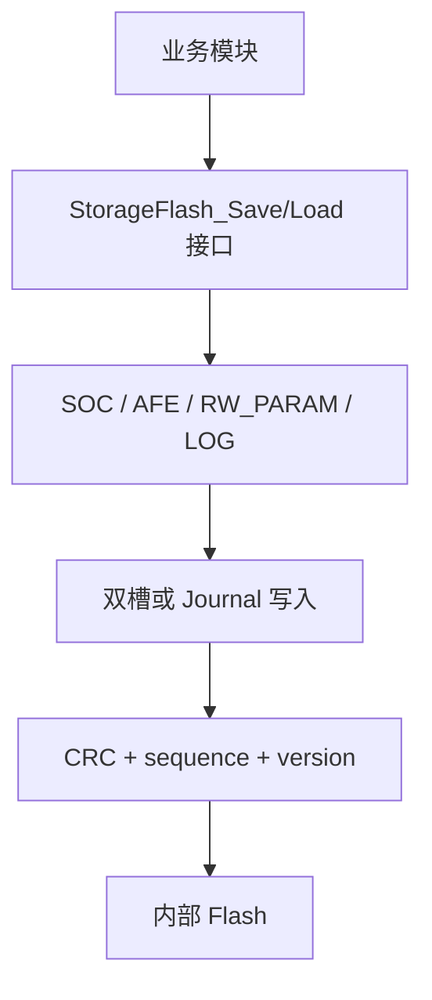
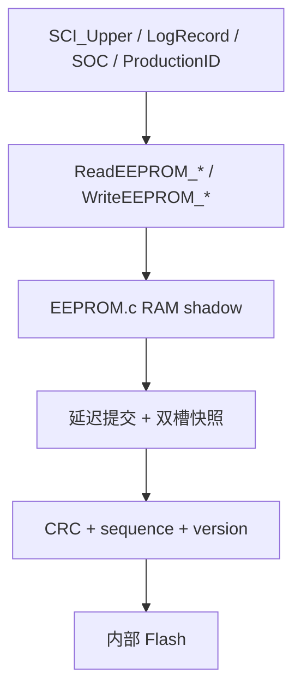

# 当前项目与旧项目改造版的存储对比

## 1. 总结

这两个项目现在都已经不依赖外部 EEPROM 芯片，但它们的存储思路不一样：

- **当前项目**更像一套“Flash 数据管理框架”
- **旧项目改造版**更像一层“EEPROM 语义兼容层”

从长期维护角度看，当前项目更干净；从业务迁移成本看，旧项目改造版更稳妥。

### 核心结论

- 当前项目采用“按数据域建模”的方式，SOC、AFE、RW_PARAM、LOG 各自独立。
- 旧项目采用“统一 EEPROM 地址镜像”的方式，上层接口不变，只替换底层持久化介质。
- 当前项目的恢复与写入策略更模块化。
- 旧项目的兼容性更强，但历史包袱更多。

## 2. 架构对比

### 2.1 当前项目

当前项目的 `Flash.c` 已经形成了完整的 Flash 存储层：

- `SOC`
- `AFE`
- `RW_PARAM`
- `LOG`

它不是在模拟 EEPROM，而是在直接保存结构化数据。

### 2.2 旧项目改造版

旧项目的 `EEPROM.c` 仍保留 EEPROM 风格接口，但底层已经换成内部 Flash。

## 3. 数据模型对比

### 3.1 当前项目的数据模型

当前项目的每类数据都有自己的存储结构。

- `STORAGE_FLASH_SOC_DATA`
- `STORAGE_FLASH_RW_PARAM_DATA`
- `STORAGE_FLASH_LOG_DATA`
- `AFE` 直接按 word 数组保存

特点：

- 结构明确
- 长度明确
- 版本明确
- 可以单独演进

### 3.2 旧项目的数据模型

旧项目的核心数据模型仍然是历史 EEPROM 地址表：

- `E2P_ADDR_START_CALIB_K`
- `E2P_ADDR_START_CALIB_B`
- `E2P_ADDR_START_EVENT_RECORD`
- `E2P_ADDR_E2POS_SERIAL_NUM`
- `E2P_ADDR_E2POS_HAEDWARE_VER`
- `E2P_ADDR_E2POS_SOFTWARE_VER`
- `EEPROM_ADDR_PASS`
- `EEPROM_ADDR_SLEEP`
- `EEPROM_ADDR_FLASHUPDATE`

特点：

- 地址布局沿用旧版本
- 业务层不用改
- 兼容成本最低
- 但不如当前项目干净

## 4. 读写链路对比

### 4.1 当前项目写链路

1. 业务模块调用 `StorageFlash_Save*`
2. 选择数据域
3. 组装 payload
4. 写入双槽或 journal
5. 写后回读校验
6. 保存成功后返回

### 4.2 旧项目写链路

1. 业务模块继续调用 `WriteEEPROM_*`
2. 先改 RAM shadow
3. 标记 dirty
4. `App_E2promDeal()` 周期性提交
5. 提交时写内部 Flash 双槽
6. 回读校验

### 4.3 当前项目读链路

1. 开机读取每个数据域的有效记录
2. 通过 `magic + version + length + sequence + crc` 选出最新合法数据
3. 业务层按结构直接使用

### 4.4 旧项目读链路

1. 开机时 `InitE2PROM()` 恢复 RAM shadow
2. `SCI_Upper`、`LogRecord`、`SOC`、`ProductionID` 等模块继续按原 API 读取
3. 上层不感知底层已经换成 Flash

## 5. 容错能力对比

### 5.1 相同点

两边都使用了这些基础可靠性机制：

- `magic`
- `version`
- `sequence`
- `crc`
- 双槽备份
- 写后回读校验

### 5.2 当前项目更强的地方

当前项目的容错更像“框架化”设计：

- 不同数据域可独立恢复
- 日志数据支持 journal 型写入
- SOC 数据支持旧版本兼容
- 可以针对不同数据域使用不同保存策略

### 5.3 旧项目的容错特点

旧项目的容错更像“统一补丁”：

- 先恢复整个 EEPROM 影子
- 再让上层模块继续初始化
- 核心是保证业务不崩

这适合老工程改造，但对后续扩展不如当前项目灵活。

## 6. SOC 逻辑对比

### 6.1 当前项目 SOC

当前项目把 SOC 当作一个独立数据域：

- 专用结构
- 专用 snapshot
- 专用版本兼容
- 专用恢复接口

优点：

- SOC 和别的数据互不干扰
- 容易做版本升级
- 容易做测试

### 6.2 旧项目 SOC

旧项目的 SOC 已经改成内部 Flash 持久化，但仍保留旧模块边界：

- `SocEnhance.c` 内部做快照
- 底层通过 `ReadEEPROM_Word_NoZone()` / `WriteEEPROM_Word_NoZone()` 存取
- `SeriousFaultFlag` 仍作为启动恢复分支

优点：

- 业务逻辑不用重写
- 改动小

缺点：

- SOC 的数据组织方式仍受旧 EEPROM 结构影响
- 和 `param.c` 还有一层并存关系

## 7. 日志逻辑对比

### 7.1 当前项目

日志是独立 storage domain，支持 journal 风格写入。

### 7.2 旧项目

事件记录仍是旧式环形记录：

- `BMS_LOG_POINT`
- `BMS_LOG_RECORD[100][2]`

只是底层从 EEPROM 换成了内部 Flash。

这说明：

- 功能上已经可读可写
- 架构上仍然是旧实现

## 8. 参数逻辑对比

### 8.1 当前项目

`RW_PARAM` 是单独对象：

- 结构清晰
- 版本单独控制
- 可独立双槽保存

### 8.2 旧项目

旧项目实际出现了两套参数持久化：

- `EEPROM.c`
- `param.c`

这两套都已经改成内部 Flash，但职责不同：

- `EEPROM.c`：兼容旧 EEPROM 语义
- `param.c`：保存 `g_tParam`

这个设计可用，但不是最优结构。

## 9. Flash 寿命对比

### 9.1 当前项目

当前项目的寿命控制更细：

- 数据域分开
- 写入更有针对性
- 有 journal 模式
- 写放大更容易控制

### 9.2 旧项目

旧项目已经通过以下方式降低写入频率：

- RAM shadow
- 延迟提交
- 同值不重复写
- 双槽轮换

但由于历史结构更重，写入粒度不如当前项目明确。

## 10. 迁移成熟度对比

### 10.1 当前项目

成熟度更高，适合作为模板：

- 存储接口清楚
- 恢复路径清楚
- 扩展路径清楚

### 10.2 旧项目改造版

可用、稳定、兼容性强，但还不是最简洁的最终形态：

- 继承了大量历史命名
- 有 legacy 地址表
- 有两层持久化并存

## 11. 结论

如果从“**工程长期维护**”角度：

- 当前项目更适合作为最终存储模型

如果从“**老工程平滑替换**”角度：

- 旧项目改造版是正确的中间落地方案

如果从“**是否已经完成 EEPROM 替换**”角度：

- 已完成主链路替换
- 上层调用基本不需要动
- 功能已经能读可写
- 但仍保留少量历史包袱，不应宣称完全零残留

## 12. 建议

1. 如果后面继续演进旧项目，建议逐步把 `EEPROM.c` 的旧地址语义收敛成更明确的数据域。
2. 如果后续要统一架构，建议把 `param.c` 也并入同一套 Flash 框架，避免双重持久化体系长期并存。
3. 如果后续要做更高频日志，建议引入当前项目那种 journal 风格，而不是继续扩展旧式环形 EEPROM 逻辑。

