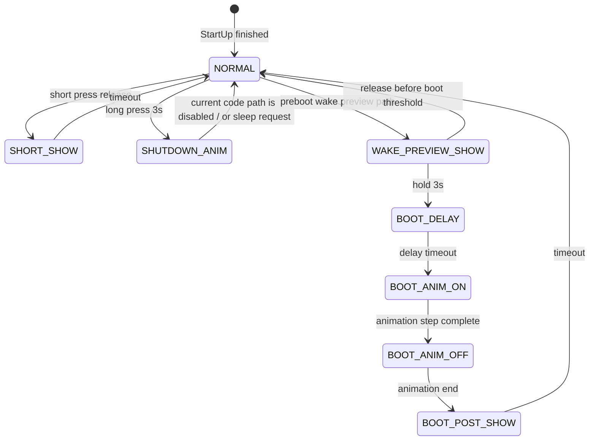

# LedBar 模块逻辑全梳理（2026-05-08）

## 1. 目的

本文档用于完整梳理当前工程中 `LedBar` 模块的逻辑边界、调用链、状态机、输入输出映射、睡眠唤醒联动以及当前实现中的保留路径与风险点。

本文重点回答以下问题：

1. `LedBar` 何时运行。
2. `LedBar` 依赖哪些系统状态。
3. `LedBar` 如何根据 SOC、充放电、故障、进水和按键决定显示内容。
4. 睡眠唤醒前预览、正式开机、短按显示、关机睡眠之间如何衔接。
5. 当前源码中哪些路径是实际执行路径，哪些只是保留代码。

---

## 2. 模块定位

`LedBar` 不是单纯的 LED 驱动层，而是一个带状态机的灯板 UI 模块，主要承担以下职责：

1. SOC 分段显示。
2. 充电态/放电态显示。
3. 故障告警覆盖显示。
4. 进水场景下的闪烁覆盖。
5. DI1/干簧管相关的短按、长按、唤醒预览、开机序列联动。
6. 关机后请求系统进入睡眠。

从架构上看，它处于“显示层 + 少量事件处理层”的组合位置，直接依赖系统状态、SOC 数据和睡眠标志位。

---

## 3. 关键文件

- [`Code/Source/LedBar.c`](/Users/cs/Downloads/work/todo/030-TI-templ/Code/Source/LedBar.c)
- [`Code/Source/LedBar.h`](/Users/cs/Downloads/work/todo/030-TI-templ/Code/Source/LedBar.h)
- [`Code/Source/main.c`](/Users/cs/Downloads/work/todo/030-TI-templ/Code/Source/main.c)
- [`Code/Source/SleepDeal.c`](/Users/cs/Downloads/work/todo/030-TI-templ/Code/Source/SleepDeal.c)
- [`Code/Source/Flash.c`](/Users/cs/Downloads/work/todo/030-TI-templ/Code/Source/Flash.c)
- [`Code/Source/RTC.c`](/Users/cs/Downloads/work/todo/030-TI-templ/Code/Source/RTC.c)
- [`Code/Source/gan_huang_guan_logi.c`](/Users/cs/Downloads/work/todo/030-TI-templ/Code/Source/gan_huang_guan_logi.c)
- [`Code/Source/System_Monitor.c`](/Users/cs/Downloads/work/todo/030-TI-templ/Code/Source/System_Monitor.c)

---

## 4. 硬件映射

### 4.1 LED 输出

`LedBar.h` 定义了 5 颗 SOC LED 和 1 个运行灯：

- `MCUO_SOC_20` -> `PB8`
- `MCUO_SOC_40` -> `PB7`
- `MCUO_SOC_60` -> `PB13`
- `MCUO_SOC_80` -> `PB12`
- `MCUO_SOC_100` -> `PB5`
- `MCUO_SOC_RUN` -> `PA5`

### 4.2 输入信号

当前源码中实际被 `LedBar` 使用的按键输入是：

- `MCUI_ENI_DI1` -> `PC13`

`LedBar.h` 里还定义了：

- `MCUI_SOC_KEY` -> `PB14`

但从当前主路径看，`MCUI_SOC_KEY` 没有进入 `APP_LedBar()` 的主要状态机，仅在 `LedBar_Show_Sleep()` 中出现，而该函数未被主循环调用。

### 4.3 需要注意的硬件语义

当前源码存在一个明显的语义混用风险：

1. `LedBar.h` 里保留了 `MCUI_SOC_KEY`。
2. 实际按键事件处理走的是 `MCUI_ENI_DI1`。
3. `SleepDeal.c` 中 DI1 唤醒预览也走的是 `MCUI_ENI_DI1`。

因此，从系统行为上看，**DI1/PC13 才是当前真正统一的灯板控制输入**。

---

## 5. 模块入口与运行时机

### 5.1 主循环入口

`main.c` 中只有在 `__FUNC__LED__` 使能时，才会进入：

```c
APP_LedBar();
```

调用位置在主循环中，见 [`main.c`](/Users/cs/Downloads/work/todo/030-TI-templ/Code/Source/main.c#L63)。

### 5.2 启动初始化

`LedBar_StartUp()` 在系统初始化阶段调用：

- `main.c -> InitDevice() -> LedBar_StartUp()`

其主要职责是：

1. 初始化输出 GPIO。
2. 清理 UI 状态。
3. 从 RTC backup domain 读取唤醒显示状态和缓存 SOC。
4. 判断是否需要进入开机序列。
5. 清除本次已消费的唤醒状态。

### 5.3 时基

`APP_LedBar()` 的执行节拍是 `100ms`，前置条件是：

- `g_st_SysTimeFlag.bits.b1Sys100msFlag != 0`
- `SystemStatus.bits.b1StartUpBMS == 0`

也就是说，`LedBar` 的常态显示、按键处理、动画推进，全部都在 100ms tick 下运行。

---

## 6. 全局状态结构

### 6.1 对外命令

`LedBar_Command` 是模块内部的运行态显示命令，定义如下：

- `LED_BAR_STARTUP`
- `LED_BAR_NORMAL`
- `LED_BAR_CHG`
- `LED_BAR_DSG`
- `LED_BAR_FAULT`

当前外部没有直接写这个变量，它主要由 `LedBar.c` 内部自己维护。

### 6.2 UI 状态机

`LedBar.c` 内部定义了 `LEDBAR_UI_MODE`：

- `LED_UI_NORMAL`
- `LED_UI_SHORT_SHOW`
- `LED_UI_WAKE_PREVIEW_SHOW`
- `LED_UI_BOOT_DELAY`
- `LED_UI_BOOT_ANIM_ON`
- `LED_UI_BOOT_ANIM_OFF`
- `LED_UI_BOOT_POST_SHOW`
- `LED_UI_SHUTDOWN_ANIM`

其中：

- `NORMAL` 是常规显示态。
- `SHORT_SHOW` 是短按 SOC 显示态。
- `WAKE_PREVIEW_SHOW` 主要是预留/过渡态。
- `BOOT_*` 是开机序列态。
- `SHUTDOWN_ANIM` 是关机序列态。

### 6.3 关键静态变量

`LedBar.c` 中的核心运行状态包括：

- `s_led_ui_mode`：当前 UI 态。
- `s_anim_step`：动画步进。
- `s_anim_step_ticks`：动画步进计数。
- `s_ui_ticks`：当前状态内的时间计数。
- `s_pending_shutdown_sleep`：关机完成后是否要进入睡眠。
- `s_cached_soc`：从备份域或当前 SOC 抓取的缓存 SOC。
- `s_key_press_ticks`：按键按下持续时间。
- `s_key_prev_pressed`：上一周期按键状态。
- `s_key_long_handled`：长按是否已经被消费。
- `s_key_wait_release`：是否要求先松手。
- `s_key_stable_pressed`：去抖后的稳定按键状态。
- `s_key_debounce_ticks`：去抖计数。
- `s_short_press_block_ticks`：短按抑制窗口。
- `s_ignore_next_release_short`：忽略长按后那次释放边沿。
- `s_wake_preview_hold_ticks`：预览阶段保留计数，当前实现中存在但实际用途较弱。

---

## 7. SOC 显示规则

### 7.1 SOC 转灯位

`LedBar_GetSocMaskFromValue()` 以 20% 为一档进行映射：

- `> 0`：点亮 `20%`
- `> 20`：再点亮 `40%`
- `> 40`：再点亮 `60%`
- `> 60`：再点亮 `80%`
- `> 80`：再点亮 `100%`

并且会强制至少点亮最低位 `20%`，也就是说只要 SOC 不是 0，最左侧灯会亮。

### 7.2 实时 SOC 与缓存 SOC

`LedBar` 使用两种 SOC 来源：

1. `LedBar_GetLiveSocMask()`  
   直接读取 `g_stCellInfoReport.SocElement.u16Soc`。

2. `LedBar_GetCachedSocMask()`  
   读取 `s_cached_soc`。

用途区别：

- 常规运行态更偏向实时 SOC。
- 唤醒预览、开机后缓存显示更偏向缓存 SOC。

---

## 8. 常规显示路径

### 8.1 `LED_UI_NORMAL`

当 UI 处于 `LED_UI_NORMAL` 时，`APP_LedBar()` 会根据 `LedBar_Command` 选择一个显示分支：

- `LED_BAR_NORMAL`
- `LED_BAR_CHG`
- `LED_BAR_DSG`
- `LED_BAR_FAULT`

### 8.2 `LED_BAR_NORMAL`

逻辑：

1. 如果 `u16Ichg != 0`，切到 `LED_BAR_CHG`。
2. 否则如果 `u16IDischg != 0`，切到 `LED_BAR_DSG`。
3. 否则全灭。

这说明 `NORMAL` 不是“固定显示一套灯效”，而是一个分发入口。

### 8.3 `LED_BAR_CHG`

充电态行为：

1. `MCUO_SOC_RUN` 置 1。
2. SOC 分段根据当前 SOC 计算。
3. `su16_ShowDelay` 形成一个闪烁节拍。
4. 当充电电流消失后回到 `LED_BAR_NORMAL`。

### 8.4 `LED_BAR_DSG`

放电态行为：

1. `MCUO_SOC_RUN` 置 1。
2. 按当前 SOC 显示累计条。
3. 当放电电流消失后，清掉所有灯并回到 `LED_BAR_NORMAL`。

### 8.5 `LED_BAR_FAULT`

当前在 `APP_LedBar()` 里这个枚举值没有独立分支逻辑，实际故障覆盖是通过 `LedBar_Show_Fault()` 在 `LED_UI_NORMAL` 末尾叠加完成的。

---

## 9. 按键逻辑

### 9.1 按键采样

`LedBar_IsKeyPressed()` 当前定义为：

```c
return (UINT8)(MCUI_ENI_DI1 == 0);
```

也就是：

- 低电平表示按下。
- 每 100ms 一次采样。
- 使用 `s_key_debounce_ticks` 做最小去抖。

### 9.2 长按触发

长按条件：

1. 系统处于开机态。
2. UI 处于 `LED_UI_NORMAL`。
3. 没有处于 `s_key_wait_release`。
4. 没有被 `s_key_long_handled` 消费。
5. 按下持续达到 `30 tick`，也就是 `3s`。

触发后当前源码会：

- 置 `s_key_long_handled = 1`
- 置 `s_key_wait_release = 1`
- 置 `s_ignore_next_release_short = 1`
- 进入 `LED_UI_SHUTDOWN_ANIM`

### 9.3 短按触发

短按条件：

1. 系统处于开机态。
2. UI 处于 `LED_UI_NORMAL`。
3. 没有被长按消费。
4. 本次按压时间 `> 0` 且 `< 3s`。
5. 没有被 `s_ignore_next_release_short` 忽略。
6. 不在短按抑制窗口内。

触发后进入 `LED_UI_SHORT_SHOW`。

### 9.4 抑制机制

`LedBar` 之所以不会在开机动画后立刻误触发短按，靠的是两个门控变量：

- `s_ignore_next_release_short`
- `s_short_press_block_ticks`

前者用于屏蔽长按后的那次释放边沿，后者用于开机/关机序列结束后的短暂抑制。

---

## 10. 短按 SOC 显示

### 10.1 当前行为

`LedBar_StartShortShow()` 只负责切换状态：

- `s_led_ui_mode = LED_UI_SHORT_SHOW`
- `s_ui_ticks = 0`

`LedBar_RunShortShow()` 的实际显示行为是：

1. 持续按实时 SOC 显示。
2. 计时到 `50 tick`，也就是 `5s`。
3. 超时后回到 `LED_UI_NORMAL`，并熄灯。

### 10.2 设计含义

这说明短按显示目前是：

- 一个一次性“查看窗口”。
- 不是循环 1s 亮/1s 灭的多轮序列。

如果你对比仓库里的历史说明文档，会发现以前存在“亮灭循环 5 次”的需求描述，但当前代码主路径已经变成了“短按后显示 5s 再退出”的实现。

---

## 11. 睡眠唤醒预览链路

### 11.1 预览触发位置

触发点在 [`SleepDeal.c`](/Users/cs/Downloads/work/todo/030-TI-templ/Code/Source/SleepDeal.c#L24)：

1. 系统从 STOP 模式唤醒。
2. 如果是 DI1 唤醒，并且按下持续至少 50ms。
3. 调 `WakeDisplay_RequestSocPreview()`。
4. 返回有效唤醒。

### 11.2 预览显示

`LedBar_HandleWakePreviewBeforeBoot()` 做的事情是：

1. 读取唤醒显示状态和缓存 SOC。
2. 立即按缓存 SOC 点亮。
3. 如果按住并且 `is_open_gan1()` 成立，就持续累计。
4. 满足 3s 后，写入 `WAKE_DISPLAY_MODE_BOOT_SEQUENCE`，熄灯并返回 `1`。
5. 如果未按满 3s 就松手，则保持预览直到预览时长足够，随后清状态并返回 `0`。

### 11.3 预览状态的持久化

`Flash.c` 使用 RTC backup domain：

- `BKP3R` 保存 `mode + soc`
- `BKP4R` 保存反码

这样可以确保：

1. 状态在复位/停止模式后仍可恢复。
2. 数据有简单的反码校验。

---

## 12. 开机链路

### 12.1 启动条件

`LedBar_StartUp()` 中，当满足以下任一条件，就会进入开机流程：

1. `wake_mode == WAKE_DISPLAY_MODE_BOOT_SEQUENCE`
2. `wake_mode == NONE && LedBar_IsKeyPressed()`

### 12.2 当前实现路径

当前源码中的开机路径是：

1. `BOOT_DELAY`
2. `BOOT_ANIM_ON`
3. `BOOT_ANIM_OFF`
4. `BOOT_POST_SHOW`
5. `NORMAL`

但要特别注意：

- `LedBar_RunBootAnimOn()` 的主体被 `#if 0` 屏蔽。
- `LedBar_RunShutdownAnim()` 的动画主体也被 `#if 0` 屏蔽。

因此，**当前源码里开机/关机动画的“完整帧推进”并没有真正启用**，实际更像是状态骨架保留。

### 12.3 关机后睡眠请求

当前关机动画函数 `LedBar_RunShutdownAnim()` 的实际 active 路径是直接：

```c
Sleep_Mode.bits.b1ForceToSleep_L3 = 1;
```

也就是说，现阶段它更像“关机后立即申请睡眠”，而不是先完成一段可见动画。

---

## 13. 进水覆盖逻辑

`APP_LedBar()` 中 `is_water_in()` 的优先级很高：

1. 如果当前 UI 正处于 `LED_UI_SHUTDOWN_ANIM`，则直接调用 `LedBar_RunShutdownAnim()` 并返回。
2. 否则第一次进入进水态时先清灯。
3. 然后每 100ms 把所有 SOC 灯位取反翻转，形成整体闪烁。

这意味着进水态会覆盖普通 SOC/充放电显示。

---

## 14. 故障覆盖逻辑

`LedBar_Show_Fault()` 只在 `s_led_ui_mode == LED_UI_NORMAL` 时叠加。

触发条件包括：

- `g_stCellInfoReport.unMdlFault_Third.all & 0x2FFA`
- `System_ERROR_UserCallback(ERROR_STATUS_TEMP_BREAK)`
- `System_ERROR_UserCallback(ERROR_STATUS_CBC_DSG)`

触发后：

- 翻转 `MCUO_SOC_ALARM`
- 清掉 `40% / 60% / 80% / 100%` 高位灯

这说明故障显示不是独立 UI 模式，而是正常态末尾的覆盖层。

---

## 15. 调用链总览

### 15.1 启动阶段

```text
main()
  -> InitDevice()
    -> LedBar_StartUp()
```

### 15.2 常态运行

```text
main loop
  -> App_SysTime()
  -> App_MOS_Relay_Ctrl()
  -> App_SleepDeal()
  -> APP_LedBar()
```

### 15.3 睡眠唤醒

```text
Sys_StopMode()
  -> IsSleepWakeupValid()
    -> WakeDisplay_RequestSocPreview()
  -> LedBar_HandleWakePreviewBeforeBoot()
  -> (必要时) WakeDisplay_RequestBootSequence()
  -> MCU reset / 正式启动
  -> LedBar_StartUp()
  -> APP_LedBar()
```

---

## 16. 状态机图



说明：

- 图中状态是“设计上的完整状态机”。
- 其中 `BOOT_ANIM_ON` 和 `SHUTDOWN_ANIM` 的实际帧推进目前被源码中的 `#if 0` 屏蔽。

---

## 17. 当前实现的真实结论

如果严格按当前源码判断，`LedBar` 的真实可执行能力可以概括为：

1. 常规 SOC / 充电 / 放电 / 故障显示是实际工作的。
2. 进水闪烁覆盖是实际工作的。
3. DI1 长按后进入关机请求是实际工作的。
4. 短按后显示 SOC 一段时间是实际工作的。
5. 睡眠唤醒前的 SOC 预览是实际工作的。
6. 开机/关机动画的完整帧推进逻辑目前更像保留骨架，主要执行路径被 `#if 0` 抑制。

---

## 18. 风险点与建议

### 18.1 输入源语义混用

`MCUI_SOC_KEY` 与 `MCUI_ENI_DI1` 并存，但主路径实际使用 `MCUI_ENI_DI1`。  
建议后续统一输入命名，减少误读。

### 18.2 `PA5` 语义冲突

`MCUO_SOC_RUN` 绑定到 `PA5`，而 `conf_gpio.h` 里 `PA5` 同时也是 `GPIO_GAN2`。  
建议确认硬件复用是否允许这种共享，或者在文档层明确它只是一个逻辑映射而不是独立外设脚。

### 18.3 动画实现与状态骨架不一致

当前代码里有较完整的状态拆分，但真正的动画帧推进被 `#if 0` 屏蔽。  
这会导致：

- 阅读时以为动画已启用。
- 实际运行时只看到状态切换和睡眠请求。

建议后续：

1. 要么把完整动画恢复。
2. 要么删掉无效保留状态，避免维护成本持续上升。

### 18.4 预览时序依赖备份域

唤醒预览与开机序列依赖 RTC backup domain。  
如果未来调整 RTC 初始化顺序、复位策略或低功耗策略，需要同步检查 `WakeDisplayState_*` 的生命周期。

---

## 19. 结论

当前 `LedBar` 模块已经形成了一条完整的“唤醒预览 -> 开机判断 -> 常规显示 -> 短按查看 -> 长按关机 -> 睡眠请求”的逻辑链，但源码中有一部分动画细节被保留为骨架，没有真正参与运行。

从维护视角看，这个模块的核心问题不是“有没有状态机”，而是：

1. 状态机已经拆开了。
2. 但实际行为与保留状态存在差距。
3. 输入源、GPIO 语义、动画路径之间仍有少量历史包袱。

如果后续要继续演进，建议先统一输入定义，再决定是否恢复完整开/关机动画，最后再整理掉不再使用的保留分支。
